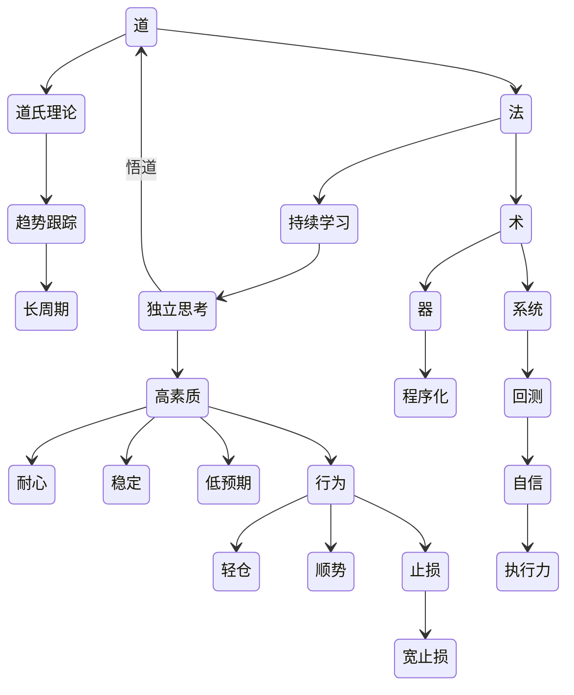

交易哲学

```mermaid
stateDiagram-v2

道 --> 法
道 --> 道氏理论
道氏理论 --> 趋势跟踪
趋势跟踪 --> 长周期
法 --> 术
法 --> 持续学习
持续学习 --> 独立思考
独立思考 --> 道 : 悟道
独立思考 --> 高素质
高素质 --> 耐心
高素质 --> 稳定
高素质 --> 低预期
高素质 --> 行为

术 --> 器

器 --> 程序化

行为 --> 轻仓
行为 --> 顺势
行为 --> 止损
止损 --> 宽止损

术 --> 系统
系统 --> 回测
回测 --> 自信
自信 --> 执行力
```

