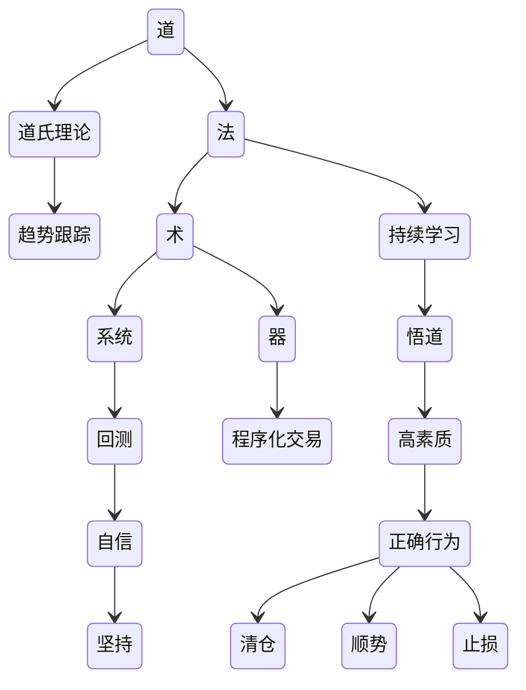

交易哲学

```mermaid
stateDiagram-v2

道 --> 法
道 --> 道氏理论
道氏理论 --> 趋势跟踪
法 --> 术
法 --> 持续学习
持续学习 --> 悟道
悟道 --> 高素质
高素质 --> 正确行为

术 --> 器

器 --> 程序化交易


正确行为 --> 清仓
正确行为 --> 顺势
正确行为 --> 止损

术 --> 系统
系统 --> 回测
回测 --> 自信
自信 --> 坚持
```

