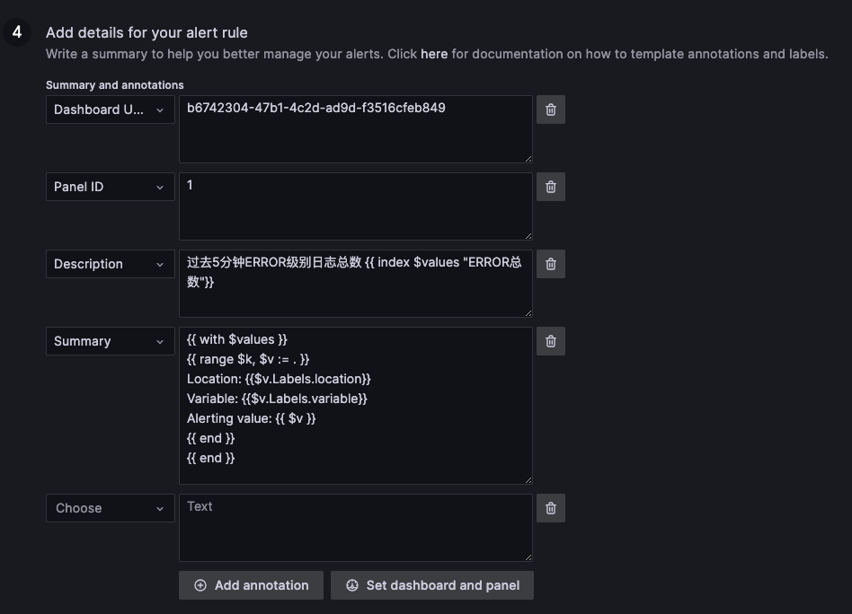
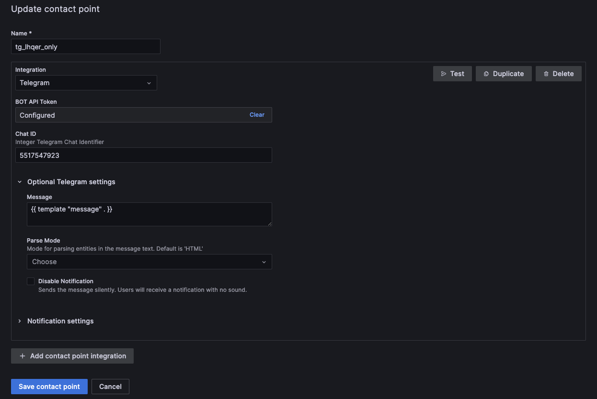
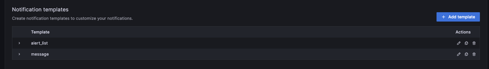

# 1. 报警规则 -- Add details for your alert rule

## 1.1. Description
    过去5分钟ERROR级别日志总数 {{ index $values "ERROR总数"}}
## 1.2. Summay 
    ERROR总数：{{ index $values "ERROR总数"}}
    ------------------------------------------
    {{ with $values }}
    {{ range $k, $v := . }}
    Location: {{$v.Labels.location}}
    Variable: {{$v.Labels.variable}}
    Alerting value: {{ $v }}
    {{ end }}
    {{ end }}
# 2. 联络点 -- Contact points

# 3. 联络点 -- Notification templates

## 3.1. message
    {{ define "message" }}{{ if gt (len .Alerts.Firing) 0 }}**报警**
    {{ template "alert_list" .Alerts.Firing }} 
    {{ end }}
    {{ if gt (len .Alerts.Resolved) 0 }}**已解决**
    {{ template "alert_list" .Alerts.Resolved }}
    {{ end }}
    {{ end }}
## 3.2. alert_list（注意换行）
    {{ define "alert_list" }}{{ range . }}{{ index .Labels "alertname" }}
    {{ index .Annotations "description" }}
    {{ end }}{{ end }}

# 4. 参考
## 4.1. Templating labels and annotations
https://grafana.com/docs/grafana/latest/alerting/fundamentals/annotation-label/variables-label-annotation/

## 4.2. 默认模版
https://github.com/grafana/grafana/blob/v9.3.8/pkg/services/ngalert/notifier/channels/default_template.go

## 4.3. grafana自定义告警模版
https://liuxingjun.github.io/2022/03/16/grafana%E8%87%AA%E5%AE%9A%E4%B9%89%E5%91%8A%E8%AD%A6%E6%A8%A1%E7%89%88/

## 4.4. Grafana如何自定义告警消息
https://www.cnaaa.net/archives/6347

## 4.5. 模版函数
https://pkg.go.dev/text/template#hdr-Functions

## 4.6. Using Go’s templating language
https://grafana.com/docs/grafana/latest/alerting/manage-notifications/template-notifications/using-go-templating-language/

## 4.7. 我的 Promtheus 到底啥时候报警？
https://aleiwu.com/post/prometheus-alert-why/
## 4.8. grafana高可用和Alerting（七）
http://www.51niux.com/?id=247