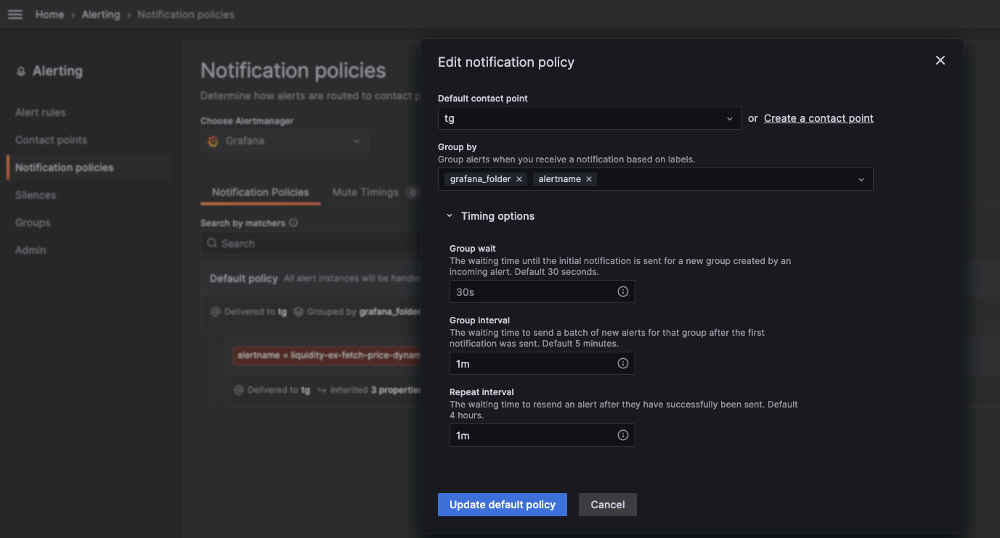

# 1. 报警规则 Alert rules
## 1.1. Set an alert rule name

## 1.2. Set a query and alert condition

## 1.3. Alert evaluation behavior
这个组件主要功能为每隔多久评估一次指标是否触发告警条件，以及持续多久触发告警条件后进行告警

## 1.4. Add details for your alert rule
## 1.5. Notifications

# 2. Contact points
## 2.1. Optional Telegram settings

## 2.2. Disable resolved message: 
這個欄位的意思是, 當觸發 alert 的情況消失時, Grafana 預設是會發一個 [OK] 的訊息通知使用者已經恢復正常了, 如果你不需要, 就把他打勾.

# 3. evaluation group

# 4. 通知策略 Notification policies

## 4.1. Group interval
    The waiting time to send a batch of new alerts for that group after the first notification was sent. Default 5 minutes.
    同一组内警报，等待group_interval时间后，再继续等待repeat_interval时间
## 4.2. Repeat interval
    The waiting time to resend an alert after they have successfully been sent. Default 4 hours.
    当group_interval时间到后，再等待repeat_interval时间后，才进行报警