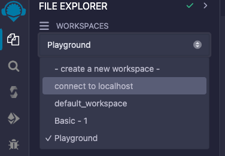
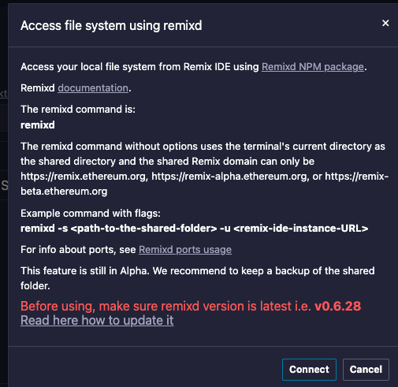

# 搭建以太坊私有链
## 安装 go-ethereum 客户端

    brew tap ethereum/ethereum
    brew install ethereum
## 检查安装是否成功：
    geth --help
# geth --datadir node1 account new
    INFO [03-20|13:41:18.527] Maximum peer count                       ETH=50 total=50
    Your new account is locked with a password. Please give a password. Do not forget this password.
    Password: 
    Repeat password: 

    Your new key was generated

    Public address of the key:   0xcA8C3fb5D8B94b36E1dA447C932BcD6B1B6480d8
    Path of the secret key file: node1/keystore/UTC--2024-03-20T05-41-29.532958000Z--ca8c3fb5d8b94b36e1da447c932bcd6b1b6480d8

    - You can share your public address with anyone. Others need it to interact with you.
    - You must NEVER share the secret key with anyone! The key controls access to your funds!
    - You must BACKUP your key file! Without the key, it's impossible to access account funds!
    - You must REMEMBER your password! Without the password, it's impossible to decrypt the key!

# geth --datadir node2 account new
    INFO [03-20|13:42:27.032] Maximum peer count                       ETH=50 total=50
    Your new account is locked with a password. Please give a password. Do not forget this password.
    Password: 
    Repeat password: 

    Your new key was generated

    Public address of the key:   0xc11442C38740D5dDFdD3d6148c2c4232BAa6d8b0
    Path of the secret key file: node2/keystore/UTC--2024-03-20T05-42-33.352871000Z--c11442c38740d5ddfdd3d6148c2c4232baa6d8b0

    - You can share your public address with anyone. Others need it to interact with you.
    - You must NEVER share the secret key with anyone! The key controls access to your funds!
    - You must BACKUP your key file! Without the key, it's impossible to access account funds!
    - You must REMEMBER your password! Without the password, it's impossible to decrypt the key!

# node1/password.txt
# node1/password.txt
# genesis.json
```json
{
  "config": {
    "chainId": 123454321,
    "homesteadBlock": 0,
    "eip150Block": 0,
    "eip155Block": 0,
    "eip158Block": 0,
    "byzantiumBlock": 0,
    "constantinopleBlock": 0,
    "petersburgBlock": 0,
    "istanbulBlock": 0,
    "berlinBlock": 0,
    "clique": {
      "period": 5,
      "epoch": 30000
    }
  },
  "difficulty": "1",
  "gasLimit": "800000000",
  "extradata": "0x0000000000000000000000000000000000000000000000000000000000000000cA8C3fb5D8B94b36E1dA447C932BcD6B1B6480d80000000000000000000000000000000000000000000000000000000000000000000000000000000000000000000000000000000000000000000000000000000000",
  "alloc": {
    "cA8C3fb5D8B94b36E1dA447C932BcD6B1B6480d8": { "balance": "1000000000000000000" },
    "c11442C38740D5dDFdD3d6148c2c4232BAa6d8b0": { "balance": "2000000000000000000" }
  }
}
```
# 复制genesis.json到node1
# 复制genesis.json到node2

# geth init --datadir node1 genesis.json
    INFO [03-20|13:50:42.660] Maximum peer count                       ETH=50 total=50
    INFO [03-20|13:50:42.664] Set global gas cap                       cap=50,000,000
    INFO [03-20|13:50:42.664] Initializing the KZG library             backend=gokzg
    INFO [03-20|13:50:42.686] Defaulting to pebble as the backing database
    INFO [03-20|13:50:42.686] Allocated cache and file handles         database=/Users/lhqer/MY/2024/data/ethereum/node1/geth/chaindata cache=16.00MiB handles=16
    INFO [03-20|13:50:43.086] Opened ancient database                  database=/Users/lhqer/MY/2024/data/ethereum/node1/geth/chaindata/ancient/chain readonly=false
    INFO [03-20|13:50:43.086] State schema set to default              scheme=hash
    INFO [03-20|13:50:43.086] Writing custom genesis block
    INFO [03-20|13:50:43.106] Persisted trie from memory database      nodes=3 size=409.00B time=19.708386ms gcnodes=0 gcsize=0.00B gctime=0s livenodes=0 livesize=0.00B
    INFO [03-20|13:50:43.337] Successfully wrote genesis state         database=chaindata hash=f2f9e2..2ba6a1
    INFO [03-20|13:50:43.337] Defaulting to pebble as the backing database
    INFO [03-20|13:50:43.337] Allocated cache and file handles         database=/Users/lhqer/MY/2024/data/ethereum/node1/geth/lightchaindata cache=16.00MiB handles=16
    INFO [03-20|13:50:43.860] Opened ancient database                  database=/Users/lhqer/MY/2024/data/ethereum/node1/geth/lightchaindata/ancient/chain readonly=false
    INFO [03-20|13:50:43.860] State schema set to default              scheme=hash
    INFO [03-20|13:50:43.860] Writing custom genesis block
    INFO [03-20|13:50:43.897] Persisted trie from memory database      nodes=3 size=409.00B time=36.755517ms gcnodes=0 gcsize=0.00B gctime=0s livenodes=0 livesize=0.00B
    INFO [03-20|13:50:44.160] Successfully wrote genesis state         database=lightchaindata hash=f2f9e2..2ba6a1


# geth init --datadir node2 genesis.json
    INFO [03-20|13:51:09.030] Maximum peer count                       ETH=50 total=50
    INFO [03-20|13:51:09.034] Set global gas cap                       cap=50,000,000
    INFO [03-20|13:51:09.035] Initializing the KZG library             backend=gokzg
    INFO [03-20|13:51:09.057] Defaulting to pebble as the backing database
    INFO [03-20|13:51:09.057] Allocated cache and file handles         database=/Users/lhqer/MY/2024/data/ethereum/node2/geth/chaindata cache=16.00MiB handles=16
    INFO [03-20|13:51:09.454] Opened ancient database                  database=/Users/lhqer/MY/2024/data/ethereum/node2/geth/chaindata/ancient/chain readonly=false
    INFO [03-20|13:51:09.454] State schema set to default              scheme=hash
    INFO [03-20|13:51:09.454] Writing custom genesis block
    INFO [03-20|13:51:09.491] Persisted trie from memory database      nodes=3 size=409.00B time=36.810342ms gcnodes=0 gcsize=0.00B gctime=0s livenodes=0 livesize=0.00B
    INFO [03-20|13:51:09.767] Successfully wrote genesis state         database=chaindata hash=f2f9e2..2ba6a1
    INFO [03-20|13:51:09.767] Defaulting to pebble as the backing database
    INFO [03-20|13:51:09.767] Allocated cache and file handles         database=/Users/lhqer/MY/2024/data/ethereum/node2/geth/lightchaindata cache=16.00MiB handles=16
    INFO [03-20|13:51:10.216] Opened ancient database                  database=/Users/lhqer/MY/2024/data/ethereum/node2/geth/lightchaindata/ancient/chain readonly=false
    INFO [03-20|13:51:10.216] State schema set to default              scheme=hash
    INFO [03-20|13:51:10.216] Writing custom genesis block
    INFO [03-20|13:51:10.236] Persisted trie from memory database      nodes=3 size=409.00B time=19.72989ms  gcnodes=0 gcsize=0.00B gctime=0s livenodes=0 livesize=0.00B
    INFO [03-20|13:51:10.452] Successfully wrote genesis state         database=lightchaindata hash=f2f9e2..2ba6a1


# bootnode

    bootnode -genkey boot.key

# bootnode -nodekey boot.key -addr :30305

    enode://7cb551b5d90f6056ae77761c38fc575dbb21400e64c8837657a97eda0d7e0d5e4db2908b611855ab886e1f2403ed13009640a24f93028c1963910b7c234086db@127.0.0.1:0?discport=30305
    Note: you're using cmd/bootnode, a developer tool.
    We recommend using a regular node as bootstrap node for production deployments.
    INFO [03-20|13:52:13.449] New local node record                    seq=1,710,913,933,447 id=b1804bb47d037d2f ip=<nil> udp=0 tcp=0


# node1
```
geth --datadir node1 --port 30306 --bootnodes "enode://7cb551b5d90f6056ae77761c38fc575dbb21400e64c8837657a97eda0d7e0d5e4db2908b611855ab886e1f2403ed13009640a24f93028c1963910b7c234086db@127.0.0.1:0?discport=30305"  --networkid 12345 --unlock 0xcA8C3fb5D8B94b36E1dA447C932BcD6B1B6480d8 --password node1/password.txt --allow-insecure-unlock --http --http.port 8545 --http.api 'web3,eth,net,debug,personal' --http.corsdomain '*' --authrpc.port 8551 --mine --miner.etherbase 0xcA8C3fb5D8B94b36E1dA447C932BcD6B1B6480d8
```
# node2
    geth --datadir node2 --port 30307 --bootnodes "enode://7cb551b5d90f6056ae77761c38fc575dbb21400e64c8837657a97eda0d7e0d5e4db2908b611855ab886e1f2403ed13009640a24f93028c1963910b7c234086db@127.0.0.1:0?discport=30305"  --networkid 12345 --unlock 0xc11442C38740D5dDFdD3d6148c2c4232BAa6d8b0 --password node2/password.txt --authrpc.port 8552


# geth attach node1/geth.ipc


    net.peerCount
    admin.peers
# 转账
    eth.sendTransaction({
      to: '0xc11442C38740D5dDFdD3d6148c2c4232BAa6d8b0',
      from: eth.accounts[0],
      value: 1000000
    });
# 发起交易, 账户0 → 账户1, 操作后并未转移金额, 只是相当于提交了一个订单
amount = web3.toWei(7,'ether')

eth.sendTransaction({from:eth.accounts[0],to:'0xc11442C38740D5dDFdD3d6148c2c4232BAa6d8b0',value:web3.toWei(0.000001,'ether')})
# 可用txpool.status查看到在本地交易池中有一个待确认的交易

# 可用 eth.getBlock("pending", true).transactions查看当前待确认交易

# 枚举系统中的账户

    eth.accounts
# 查看以下coinbase账户

    eth.coinbase
# 设置miner地址, 即给哪一个账户挖矿
    miner.setEtherbase(eth.coinbase)
    或
    miner.setEtherbase(eth.accounts[0])
# 启动挖矿
    miner.start()
# 也可以使用命令: 当新区块挖出后，挖矿即可结束
    miner.start();admin.sleepBlocks(1);miner.stop()
# 停止挖矿
    miner.stop()
# 查看区块数量
    eth.blockNumber
# 查看第三个区块对应的内容
    eth.getBlock(3)
# 查看账户0和账户1的以太余额
返回值的单位是 Wei(Wei 是以太坊中最小货币面额单位，类似比特币中的聪，1 ether = 10^18 Wei)
    eth.getBalance(eth.accounts[0])
    eth.getBalance(eth.accounts[1])
    eth.getBalance('0xc11442C38740D5dDFdD3d6148c2c4232BAa6d8b0');
    web3.eth.getBalance(web3.eth.accounts[0])
    web3.fromWei(web3.eth.getBalance(web3.eth.accounts[0]),"ether")
# attach a Javascript console to either node2
  geth attach node2/geth.ipc

eth.getTransaction("0x56e81f171bcc55a6ff8345e692c0f86e5b48e01b996cadc001622fb5e363b421")

# remixd
cd '/Users/lhqer/MY/2024/我的/项目/note/数字货币/实战/remixd_01'
remixd


## 目录说明：
  keystore 用来保存账户信息
  geth 用来保存区块信息
## 日志独立输出：
    geth --datadir data --networkid 8888 console 2>geth.log
    networkid 为上面的 genesis.json 配置的 id，以太坊主网 id 为 1
    2>geth.log 这里的 2 是代表 stderr，这里是为了让私链的以太坊日志独立输出，防止影响命令行交互的显示
## 参考
### Private Networks
https://geth.ethereum.org/docs/fundamentals/private-network
### JavaScript Console
https://geth.ethereum.org/docs/interacting-with-geth/javascript-console

