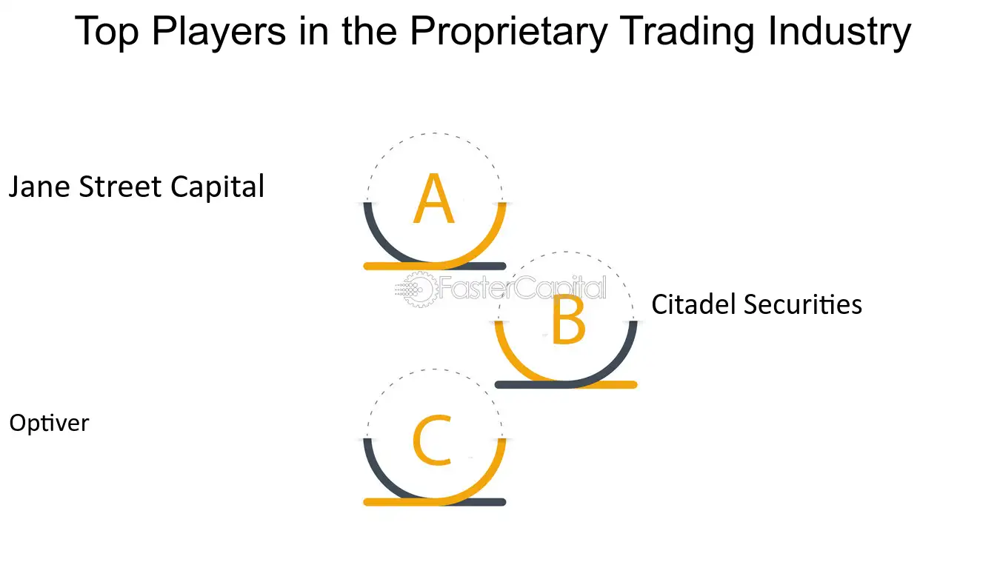

# Citadel
Citadel 是一家全球性的金融机构，由Kenneth C. Griffin于1990年创立。它主要包含两个业务部门：Citadel和Citadel Securities。Citadel是世界上最大的替代资产管理公司之一，管理着包括股票、固定收益、商品和量化策略在内的多种策略资产。而Citadel Securities是世界领先的市场做市商之一，为股票和固定收益市场等提供流动性，帮助零售和机构客户执行交易。Citadel以其使用先进技术和算法进行高频交易和市场做市策略而闻名。
# Jane Street
Jane Street 是一家全球性的量化交易公司，成立于2000年。它以在全球金融市场进行高频交易而闻名，专门从事电子市场制造和套利交易。Jane Street使用自主开发的数学模型和算法来交易各种金融产品，包括股票、债券、期权和其他衍生品。
该公司以其技术驱动和分析严谨的交易策略而著称，在金融技术界有很高的声誉。Jane Street在全球拥有多个办事处，包括纽约、伦敦和香港，是一家在全球范围内活跃的交易公司。
# Optiver
Optiver 是一家国际金融技术公司，主要从事市场制造和电子交易。成立于1986年，总部位于荷兰阿姆斯特丹，Optiver在全球金融市场中进行交易，包括股票、期权、固定收益产品和商品。该公司利用其先进的技术和算法交易策略，在为各种金融市场提供流动性的同时，追求价值并管理风险。Optiver以其创新精神和对市场深刻的理解而闻名，致力于改善金融市场的透明度和效率。